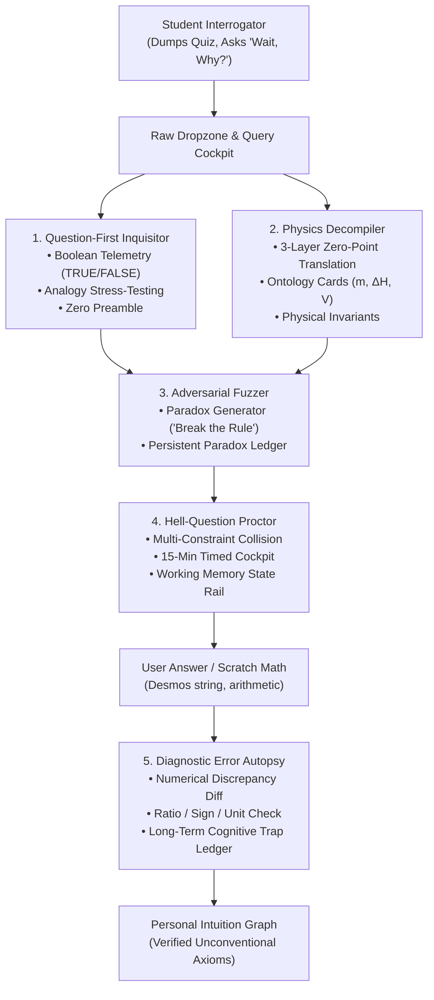
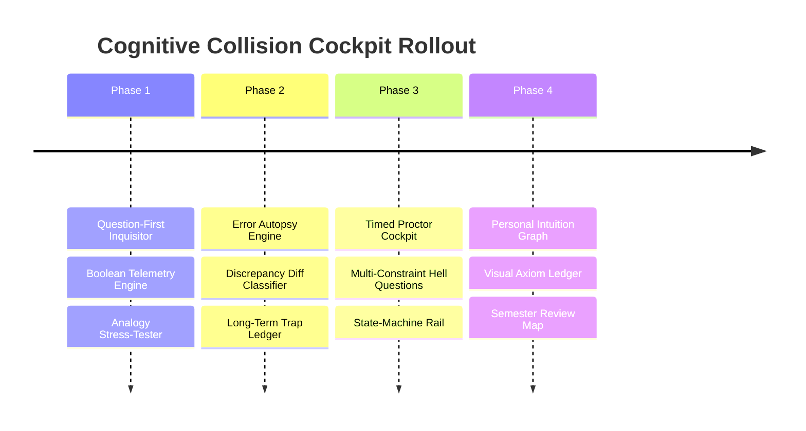

# DeepEncode: The Cognitive Collision Cockpit
## Architectural Implementation Plan & Technical Blueprint

---

## 1. Executive Summary: The Strategic Pivot

### Moving Beyond Flashcards to an Interactive Reasoning Engine
Standard study tools (Anki, RemNote, Quizlet) operate on an atomic model: $A \longrightarrow B$. For an unconventional, first-principles thinker—someone who found AP Calculus BC Unit 10 (Taylor series & convergence) intuitive because they saw it as kinematic trajectory matching—isolated flashcards are rejected as arbitrary noise.

The 500k-token study analysis revealed that actual learning occurs inside a **4-Phase Cognitive Collision Loop**:
1. **The Raw Dump & Orientation:** Immediate macro-map of governing physical rules from messy problem sets or slides.
2. **Adversarial Fuzzing ("Wait, Why?"):** Actively trying to break rules with edge cases (e.g. *"Why does Ca(OH)₂ end in -ide if oxygens mean -ate?"* or *"Why does ATP hydrolysis release energy if breaking bonds requires energy?"*).
3. **High-Pressure Timed Execution:** Proctoring multi-constraint "Hell Questions" under a countdown timer.
4. **The Error Autopsy:** Granular debugging of mathematical discrepancies (sign inversions, factor of 2 stoichiometry errors, factor of 1000 unit bugs).

This plan elevates DeepEncode from an artifact generator into the **Cognitive Collision Cockpit**: an interrogation-first software environment.

---

## 2. Architecture & Subsystem Integration

---

## 3. Detailed Component Specifications

### Component 1: The Question-First Inquisitor (`app/inquisitor/`)
* **Purpose:** Puts the user in the driver's seat as the investigator rather than a passive test-taker.
* **Input Surface:** Rapid-fire input bar accepting text hypotheses, messy problem snippets, or math formulas.
* **Protocol & Telemetry:**
  1. **Line 1: Boolean Verdict:** Instant `[ 🟢 TRUE ]`, `[ 🔴 FALSE ]`, or `[ 🟡 TRUE WITH 1 BOUNDARY TRIPWIRE ]`.
  2. **Line 2–4: Physical Invariant Proof:** Validating the unconventional intuition (e.g., why viewing Taylor Series as kinematic velocity/acceleration matching is mathematically rigorous).
  3. **Line 5: The Boundary Tripwire:** The exact edge case where the analogy breaks (e.g., $f(x) = e^{-1/x^2}$ where all derivatives at zero are $0$, yet the function is non-zero).

### Component 2: The Physics Decompiler (`lib/mr-m/decompiler.ts`)
* **Purpose:** Deconstructs superficial textbook jargon into invariant physical coordinate systems.
* **The 3-Layer Deconstruction:**
  * **Layer 0 (Textbook Jargon):** What the curriculum calls it (*"High-energy bond"*, *"Solubility chart row 4"*).
  * **Layer 1 (Coordinate Origin / Zero-Point):** Where the zero-point sits ($E=0$ at infinite separation in vacuum; displacement vs distance).
  * **Layer 2 (The Invariant Balance Sheet):** The governing conservation law (Coulomb's Law, Conservation of Charge/Energy).
* **Ontology Card Integration:** Elevates [`lib/mr-m/types.ts`](file:///C:/Users/vinso/.gemini/antigravity/scratch/Encode/lib/mr-m/types.ts#L33-L42) (`OntologyCard`):
  * Physical identity of every variable.
  * Explicit *"What It Is NOT"* warning (e.g. *mass of the water, NOT the dissolved solute*).
  * Dimensional scaling (what happens if this variable doubles).

### Component 3: The Adversarial Fuzzer ("Break the Rule" Mode)
* **Purpose:** Automates the user's natural tendency to fuzz rules like a software engineer testing an API.
* **Mechanism:**
  * The user provides a standard rule; the system returns **3 Boundary Inversions** designed to produce apparent cognitive dissonance:
    1. *The Fractional Paradox:* $\text{Fe}_3\text{O}_4$ oxidation states ($+8/3$) vs discrete electron transfers.
    2. *The Naming Anomaly:* $\text{Ca(OH)}_2$ ending in `-ide` despite containing oxygen.
    3. *The Solubility Collision:* Halides precipitate, but $\text{NaCl}$ dissolves.
  * As the user resolves each paradox, the resolution is committed to the **Paradox Ledger** ([`lib/mr-m/ledger.ts`](file:///C:/Users/vinso/.gemini/antigravity/scratch/Encode/lib/mr-m/ledger.ts)).

### Component 4: The Hell-Question Timed Proctor (`components/proctor/`)
* **Purpose:** Replaces passive flashcard review with high-pressure, multi-constraint timed problem execution.
* **Architecture:**
  * Generates a **Multi-Constraint Collision**:
    * Constraint 1: Unit / Coordinate shift ($\text{torr}$, $\text{mL}$, $\text{J}/(\text{g}\cdot^\circ\text{C})$ vs $\text{kJ}/\text{mol}$).
    * Constraint 2: Limiting reactant boundary condition with non-1:1 stoichiometry.
    * Constraint 3: Latent heat phase change plateau mid-reaction.
  * **The Proctor HUD:**
    * 15- or 20-minute real-time countdown clock.
    * Working Memory State-Machine Rail ([`StateMachineRail.tsx`](file:///C:/Users/vinso/.gemini/antigravity/scratch/Encode/components/mr-m/StateMachineRail.tsx)): Forces linear progression (State 1: System Demand $\to$ State 2: System Supply $\to$ State 3: Stoichiometric Bridge), preventing cognitive overflow.

### Component 5: The Diagnostic Error Autopsy Engine (`lib/mr-m/autopsy.ts`)
* **Purpose:** Diagnoses *why* the user's scratch math failed, instead of merely stating the correct answer.
* **The Discrepancy Classifier:**
  * Compares $A_{\text{user}}$ against $A_{\text{correct}}$:
    * **Ratio Check ($\approx 0.5, 2.0, 3.0$):** Flag `MISSING_SUBSCRIPT` or stoichiometric factor (e.g. neglected that $\text{H}_2\text{O}$ has 2 Hydrogens).
    * **Sign Check ($-X$ vs $+X$):** Flag `SIGN_FLIP` / `ORDER_INVERSION` (Products minus Reactants reversed, or $q_{\text{rxn}} = -q_{\text{soln}}$ negative sign dropped).
    * **Dimensional Scaling ($\approx 10^{\pm 3}$):** Flag `DIMENSIONAL_CONVERSION_ERROR` ($\text{mL} \to \text{L}$ or $\text{J} \to \text{kJ}$ omitted).
  * Logs the error into the **Long-Term Cognitive Trap Ledger**:
    * Tracks persistent failure patterns across the entire semester.
    * Displays pre-flight warnings before the student attempts a new problem in that domain.

### Component 6: The Personal Intuition Graph (`components/intuition-graph/`)
* **Purpose:** Replaces 100 isolated flashcards with a visual network of the user's personal, verified unconventional breakthroughs.
* **Node Schema:**
  * **Invariant Axiom:** *Taylor Series = Kinematic derivative matching at coordinate origin.*
  * **Verified Intuition:** *Convergence = Tail decay faster than geometric series $\sum r^n$.*
  * **Boundary Note:** *Smooth non-analytic functions ($e^{-1/x^2}$) where derivatives vanish at the origin.*

---

## 4. Phased Implementation Roadmap

### Phase 1: Question-First Inquisitor & Boolean Telemetry
* Build `app/inquisitor/` UI and API route with zero conversational throat-clearing.
* Implement structured prompt template enforcing the Boolean verdict, mathematical proof, and boundary tripwire.
* Support instant scratchpad pasting (Desmos formulas, raw math expressions).

### Phase 2: Diagnostic Error Autopsy & Discrepancy Diff
* Build `lib/mr-m/autopsy.ts` discrepancy classifier with numeric and AST comparison.
* Hook into existing `lib/mr-m/trap-card.ts` and `TRAP_IDS` (`sign_flip`, `missing_subscript`, `factor_of_two`, etc.).
* Connect autopsy reports to the persistent Trap Ledger in `lib/mr-m/ledger.ts`.

### Phase 3: Hell-Question Timed Proctor Cockpit
* Build `components/proctor/HellProctorModal.tsx` with a countdown clock and multi-constraint problem synthesizer.
* Integrate `StateMachineRail.tsx` to lock intermediate states and scaffold working memory during complex multi-step problems.

### Phase 4: Personal Intuition Graph & Decompiler Integration
* Extend `components/mr-m/` with an interactive Node-Link graph displaying verified mental models and resolved paradoxes.
* Provide an end-of-semester "Axiom Review Mode" where the student reviews their 15 core mental breakthroughs rather than hundreds of disjointed flashcards.

---

## 5. Verification & Safety Guarantees

* **Zero Regressions:** All 872 existing unit tests must remain 100% green.
* **Separation of Concerns:** Does not disrupt existing RemNote/Anki export pathways; acts as the primary interactive cockpit.
* **Performance:** Instant sub-second response times for scratchpad math evaluation and discrepancy classification.

---

## 6. Implementation status

Written after the first pass, so the plan and the code do not drift apart. Three
of this document's engines turned out to be built already, in the course of the
Mr M work — and saying which is more useful than pretending they shipped here.

### Shipped in this pass

**Component 1 — the Question-First Inquisitor** (`lib/inquisitor/contract.ts`,
`lib/inquisitor/parse.ts`, `app/api/inquisitor/route.ts`,
`components/InquisitorModal.tsx`). One claim in; one of three verdicts out, on
the first token: `TRUE`, `FALSE`, `TRUE_WITH_BOUNDARY_TRIPWIRE`. The proof names
the governing law and either derives the claim from it or shows where the
derivation fails; a `FALSE` cannot arrive without the construction that does
hold. Two refusals are load-bearing rather than defensive, and both are
enforced in code, not just asked for in the prompt:

* a **tripwire verdict with no tripwire is downgraded to `TRUE`** and the panel
  says so — the only way to "repair" it is to invent the boundary, and a learner
  who believes their intuition has a known limit when nobody has found one is
  worse off than one who believes it is simply true;
* a verdict **with no proof is refused outright** (HTTP 422 carrying the reason)
  rather than rendered, because an unsupported claim about rigour is a coin flip
  that got lucky.

The claim is quoted back above the verdict, so a misreading is visible instead
of hidden.

**The paradox half of Component 3's mechanism.** A boundary tripwire is a live
contradiction for this learner — the claim holds *and* there is a named case
where it does not — so it can be committed to the ledger this document already
pointed at (`lib/mr-m/ledger.ts`), which holds it open until a sentence closes
it. Committing is the learner's click, never automatic, mirroring the autopsy's
rule that the learner declares their own confidence. Opening the cockpit also
pre-flights what the topic has already caught them on, trap cards included — the
"pre-flight warnings before the student attempts a new problem in that domain"
from Component 5.

### Already existed before this pass

* **Component 5's discrepancy classifier** is `classifyTrap` in
  `lib/mr-m/diagnostics.ts`: the ratio, sign, magnitude and unit signatures, the
  subscript and operand-order rules, with the arithmetic computed in code rather
  than by the model. Its trap taxonomy (`TRAP_IDS`) and the autopsy→card builder
  (`lib/mr-m/trap-card.ts`) exist too, along with the autopsy panel.
* **The paradox ledger** (Component 3's persistence) is `lib/mr-m/ledger.ts`.
* **The state-machine rail** (Component 4) is `components/mr-m/StateMachineRail.tsx`.
* **The 3-layer zero-point translation** (Component 2) is the `axiomFirst`
  payload in `lib/mr-m/types.ts` (`governingLaw`, `coordinateOrigin`,
  `zeroPoint`), asked for by the encode directive and surfaced by
  `AxiomFirstPanel`. What this plan calls a separate `decompiler.ts` would be a
  second name for the same three layers.

### Not built, and deliberately

* **Component 4, the Hell-Question timed proctor.** A countdown clock plus a
  multi-constraint synthesizer is its own surface with its own timing and
  interruption semantics; the rail it would reuse already exists. Next pass.
* **Component 6, the Personal Intuition Graph.** An interactive node-link map of
  verified axioms and resolved paradoxes is a rendering subsystem, not an
  extension of anything here.
* **Component 2's `decompiler.ts` as a standalone module.** The three layers are
  already shipped as the `axiomFirst` payload; adding a parallel module would
  split one concept across two names.
* **Component 3's automatic fuzzing** ("give me 3 boundary inversions for this
  rule"). The ledger half is shipped; a second generator for it would duplicate
  the inquisitor's boundary path, so it belongs in the same contract if it is
  wanted — one claim at a time is what the surface is built around.

### Verification

Unit tests pin the contract and every refusal (`tests/unit/inquisitor.test.ts`),
including that a held boundary becomes an unresolved ledger entry and that
re-committing the same boundary updates that record instead of stacking copies.
The browser spec (`e2e/inquisitor.spec.ts`) drives the real sheet: the verdict
and its law on screen, the boundary rendered, a committed boundary still open
after the sheet is closed and reopened, a false read showing its fix, and a
refused read reported as a refusal rather than rendered.

## 7. Implementation status: Phases 2–5

Written after the adaptive-escalation pass. This document's Component 4 (the
timed proctor) and Component 5 (the autopsy engine) are the same two builds the
later "Adaptive Escalation, Timed Crucibles & The Error Autopsy Engine"
specification describes, so they are recorded here rather than in a parallel
document: §6's "not built, and deliberately" no longer applies to either.

### The Error Autopsy (Component 5, Phase 2)

`lib/mr-m/autopsy.ts` answers *which line of the mental compiler threw the
exception*, and it is deliberately two-layered. The structural layer is the
shipped `classifyTrap`; the numeric layer is new — every quantity in the
expected answer is crossed against every quantity the learner wrote, each ratio
is folded onto its magnitude so a factor of two reads as `2` from either
direction, and the shape is named (2, 3, 1000, or a pure sign inversion).

Two rules carry the engine. **Arithmetic is never asked of a model**: `0.0336 ÷
0.0168 = 2.00` is computed in TypeScript from the learner's own numbers
(`app/api/autopsy/route.ts` runs on the checker slot, and only ever writes the
narrative). And **no clean signal means no diagnosis**: a fracture that survives
neither layer returns `null` and the panel says nothing, because an invented
diagnosis is exactly the arbitrary noise this mode exists to remove. A sign
inversion sits a tier above every magnitude shape, so precedence is a property
of the taxonomy rather than of crossing order.

Patches are persisted in `lib/mr-m/ledger.ts` as an extension of the paradox
ledger: the same fracture on the same topic **re-opens its record and
increments `hits`** instead of stacking a near-duplicate, which is what lets a
pre-flight warning state how many times the fault has actually fired. Only a
repeat warns (`REPEAT_HITS`), capped so the strip stays readable, and only
against the topic the next attempt is really timed against.

### The Constraint-Mutation Matrix (Phase 3)

`lib/escalation/mutation.ts` holds the three tiers and the deterministic gates
that decide whether a generated variant is actually the tier it claims. Beyond
numerical substitution, the mutations are structural: unequal stoichiometric
ratios, a non-unit density that makes `m_solute` and `m_solution` disagree, and
at Tier 3 a phase change with its latent-heat term and boundary work. Tier 2 is
a **quorum** — two of its three moves is the tier, and the individual moves are
reported but not demanded — which is why "is this Tier 2" has exactly one
answer. Tier 3 is refused in both directions: a variant that treats a phase
change as a plain `ΔT` fails the latent-heat and boundary checks, and the
refusal names the requirement rather than saying the model ignored the
directive. Strong model, because the numbers have to stay physically valid.

### The Timed Crucible (Component 4, Phase 4)

`components/crucible/CrucibleModal.tsx` fronts `app/api/crucible/route.ts`. The
model writes the problems and declares each *state*'s weight; it never
touches the clock. `lib/crucible/budget.ts` allocates the sprint across those
weights by the largest-remainder method, so the HUD's targets are whole seconds
that sum to exactly the clock it is pacing, and the pacing bands are compared on
integer percents — `1 - 0.2` is not exactly `0.8` in binary floating point, and a
flag that disagrees with the arithmetic it prints is worse than no flag. The
summary reports where the clock went and, separately, how much of an overrun was
recovered, because recovering under load is the skill the rep trains. It never
reports speed as a grade. The client re-runs the same coercion the route does, so
a payload that is not a state machine is refused rather than paced.

### The ZPD Governor, Concept Fusion and the Emergency Triage Buffer (Phase 5)

`lib/escalation/governor.ts` escalates on two consecutive **clean** wins — solved
with no clue rung requested — and a miss zeroes the streak rather than pausing
it, because a failure is direct evidence that the difficulty is not too low.
The decision is returned with its reason and rendered, since a difficulty knob
the learner cannot see is indistinguishable from a bug.
`lib/escalation/fusion.ts` supplies the cross-chapter collision the boss level
is briefed with. `lib/crisis/buffer.ts` and
`components/crisis/EmergencyTriageModal.tsx` are the night everything is due at
once: a freeze is only offered when the marginal grade risk can be shown, the
panic is dismantled with the weighted-average arithmetic, and an item with no
stated weight is listed as withheld with what would make it decidable instead of
being guessed at. The runway renders one task for ninety minutes.

### Model routing

The split §2 already describes is used literally: the checker slot
(`geminiCheckerModel`) reads claims, decomposes a problem into a skeleton, reads
a panicking dump (`/api/crisis`) and writes the autopsy narrative
(`/api/autopsy`); the strong slot (`geminiModel`) synthesizes clue rungs,
boss-level collisions and constraint-mutated problems (`/api/mutation`,
`/api/crucible`); and all arithmetic — ratios, grade risk, clock allocation,
pacing — happens in TypeScript. A route asks for a slot with `isChecker` and the
resolver in `lib/ai-client.ts` owns the rest, including its own default and
model fallback chain, so no route hardcodes a model name.

### Verification

`tests/unit/mr-m-autopsy.test.ts`, `tests/unit/mr-m-ledger.test.ts` (the patch
half), `tests/unit/escalation-mutation.test.ts`,
`tests/unit/escalation-governor.test.ts`, `tests/unit/escalation-fusion.test.ts`,
`tests/unit/crucible-budget.test.ts` and `tests/unit/crisis-buffer.test.ts` pin
every gate and every refusal. `e2e/cockpit-escalation.spec.ts` drives the two new
sheets in the browser: the state-by-state time budget, the pacing read, the
pre-flight tripwire drawn from a real patch ledger (with a single-hit slip
staying silent), a sprint that is not a state machine refused instead of
rendered, and the freeze → arithmetic → ninety-minute runway flow.
