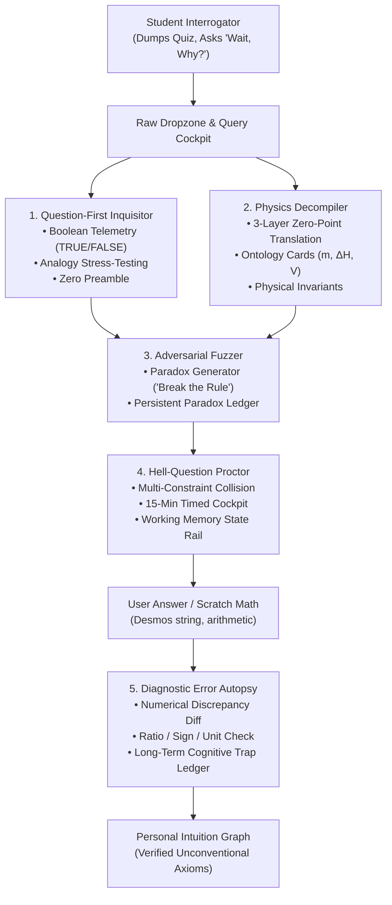
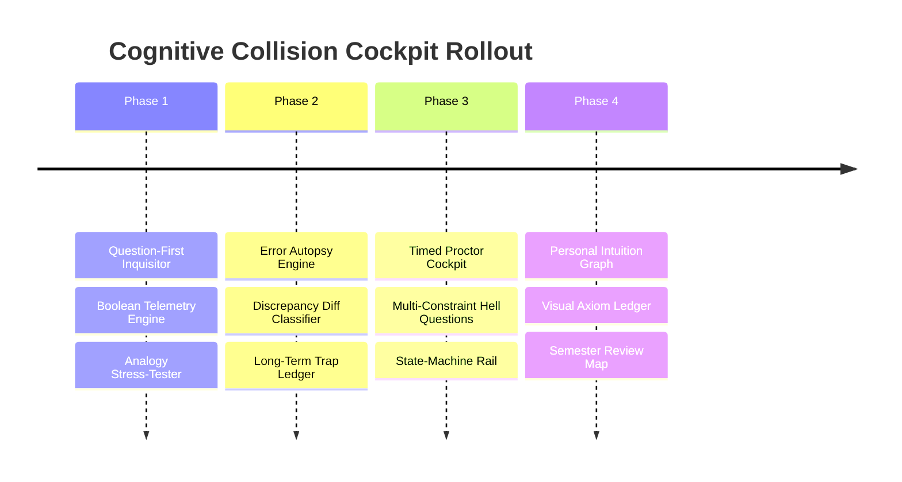

# DeepEncode: The Cognitive Collision Cockpit
## Architectural Implementation Plan & Technical Blueprint

---

## 1. Executive Summary: The Strategic Pivot

### Moving Beyond Flashcards to an Interactive Reasoning Engine
Standard study tools (Anki, RemNote, Quizlet) operate on an atomic model: $A \longrightarrow B$. For an unconventional, first-principles thinker—someone who found AP Calculus BC Unit 10 (Taylor series & convergence) intuitive because they saw it as kinematic trajectory matching—isolated flashcards are rejected as arbitrary noise.

The 500k-token study analysis revealed that actual learning occurs inside a **4-Phase Cognitive Collision Loop**:
1. **The Raw Dump & Orientation:** Immediate macro-map of governing physical rules from messy problem sets or slides.
2. **Adversarial Fuzzing ("Wait, Why?"):** Actively trying to break rules with edge cases (e.g. *"Why does Ca(OH)₂ end in -ide if oxygens mean -ate?"* or *"Why does ATP hydrolysis release energy if breaking bonds requires energy?"*).
3. **High-Pressure Timed Execution:** Proctoring multi-constraint "Hell Questions" under a countdown timer.
4. **The Error Autopsy:** Granular debugging of mathematical discrepancies (sign inversions, factor of 2 stoichiometry errors, factor of 1000 unit bugs).

This plan elevates DeepEncode from an artifact generator into the **Cognitive Collision Cockpit**: an interrogation-first software environment.

---

## 2. Architecture & Subsystem Integration

---

## 3. Detailed Component Specifications

### Component 1: The Question-First Inquisitor (`app/inquisitor/`)
* **Purpose:** Puts the user in the driver's seat as the investigator rather than a passive test-taker.
* **Input Surface:** Rapid-fire input bar accepting text hypotheses, messy problem snippets, or math formulas.
* **Protocol & Telemetry:**
  1. **Line 1: Boolean Verdict:** Instant `[ 🟢 TRUE ]`, `[ 🔴 FALSE ]`, or `[ 🟡 TRUE WITH 1 BOUNDARY TRIPWIRE ]`.
  2. **Line 2–4: Physical Invariant Proof:** Validating the unconventional intuition (e.g., why viewing Taylor Series as kinematic velocity/acceleration matching is mathematically rigorous).
  3. **Line 5: The Boundary Tripwire:** The exact edge case where the analogy breaks (e.g., $f(x) = e^{-1/x^2}$ where all derivatives at zero are $0$, yet the function is non-zero).

### Component 2: The Physics Decompiler (`lib/mr-m/decompiler.ts`)
* **Purpose:** Deconstructs superficial textbook jargon into invariant physical coordinate systems.
* **The 3-Layer Deconstruction:**
  * **Layer 0 (Textbook Jargon):** What the curriculum calls it (*"High-energy bond"*, *"Solubility chart row 4"*).
  * **Layer 1 (Coordinate Origin / Zero-Point):** Where the zero-point sits ($E=0$ at infinite separation in vacuum; displacement vs distance).
  * **Layer 2 (The Invariant Balance Sheet):** The governing conservation law (Coulomb's Law, Conservation of Charge/Energy).
* **Ontology Card Integration:** Elevates [`lib/mr-m/types.ts`](file:///C:/Users/vinso/.gemini/antigravity/scratch/Encode/lib/mr-m/types.ts#L33-L42) (`OntologyCard`):
  * Physical identity of every variable.
  * Explicit *"What It Is NOT"* warning (e.g. *mass of the water, NOT the dissolved solute*).
  * Dimensional scaling (what happens if this variable doubles).

### Component 3: The Adversarial Fuzzer ("Break the Rule" Mode)
* **Purpose:** Automates the user's natural tendency to fuzz rules like a software engineer testing an API.
* **Mechanism:**
  * The user provides a standard rule; the system returns **3 Boundary Inversions** designed to produce apparent cognitive dissonance:
    1. *The Fractional Paradox:* $\text{Fe}_3\text{O}_4$ oxidation states ($+8/3$) vs discrete electron transfers.
    2. *The Naming Anomaly:* $\text{Ca(OH)}_2$ ending in `-ide` despite containing oxygen.
    3. *The Solubility Collision:* Halides precipitate, but $\text{NaCl}$ dissolves.
  * As the user resolves each paradox, the resolution is committed to the **Paradox Ledger** ([`lib/mr-m/ledger.ts`](file:///C:/Users/vinso/.gemini/antigravity/scratch/Encode/lib/mr-m/ledger.ts)).

### Component 4: The Hell-Question Timed Proctor (`components/proctor/`)
* **Purpose:** Replaces passive flashcard review with high-pressure, multi-constraint timed problem execution.
* **Architecture:**
  * Generates a **Multi-Constraint Collision**:
    * Constraint 1: Unit / Coordinate shift ($\text{torr}$, $\text{mL}$, $\text{J}/(\text{g}\cdot^\circ\text{C})$ vs $\text{kJ}/\text{mol}$).
    * Constraint 2: Limiting reactant boundary condition with non-1:1 stoichiometry.
    * Constraint 3: Latent heat phase change plateau mid-reaction.
  * **The Proctor HUD:**
    * 15- or 20-minute real-time countdown clock.
    * Working Memory State-Machine Rail ([`StateMachineRail.tsx`](file:///C:/Users/vinso/.gemini/antigravity/scratch/Encode/components/mr-m/StateMachineRail.tsx)): Forces linear progression (State 1: System Demand $\to$ State 2: System Supply $\to$ State 3: Stoichiometric Bridge), preventing cognitive overflow.

### Component 5: The Diagnostic Error Autopsy Engine (`lib/mr-m/autopsy.ts`)
* **Purpose:** Diagnoses *why* the user's scratch math failed, instead of merely stating the correct answer.
* **The Discrepancy Classifier:**
  * Compares $A_{\text{user}}$ against $A_{\text{correct}}$:
    * **Ratio Check ($\approx 0.5, 2.0, 3.0$):** Flag `MISSING_SUBSCRIPT` or stoichiometric factor (e.g. neglected that $\text{H}_2\text{O}$ has 2 Hydrogens).
    * **Sign Check ($-X$ vs $+X$):** Flag `SIGN_FLIP` / `ORDER_INVERSION` (Products minus Reactants reversed, or $q_{\text{rxn}} = -q_{\text{soln}}$ negative sign dropped).
    * **Dimensional Scaling ($\approx 10^{\pm 3}$):** Flag `DIMENSIONAL_CONVERSION_ERROR` ($\text{mL} \to \text{L}$ or $\text{J} \to \text{kJ}$ omitted).
  * Logs the error into the **Long-Term Cognitive Trap Ledger**:
    * Tracks persistent failure patterns across the entire semester.
    * Displays pre-flight warnings before the student attempts a new problem in that domain.

### Component 6: The Personal Intuition Graph (`components/intuition-graph/`)
* **Purpose:** Replaces 100 isolated flashcards with a visual network of the user's personal, verified unconventional breakthroughs.
* **Node Schema:**
  * **Invariant Axiom:** *Taylor Series = Kinematic derivative matching at coordinate origin.*
  * **Verified Intuition:** *Convergence = Tail decay faster than geometric series $\sum r^n$.*
  * **Boundary Note:** *Smooth non-analytic functions ($e^{-1/x^2}$) where derivatives vanish at the origin.*

---

## 4. Phased Implementation Roadmap

### Phase 1: Question-First Inquisitor & Boolean Telemetry
* Build `app/inquisitor/` UI and API route with zero conversational throat-clearing.
* Implement structured prompt template enforcing the Boolean verdict, mathematical proof, and boundary tripwire.
* Support instant scratchpad pasting (Desmos formulas, raw math expressions).

### Phase 2: Diagnostic Error Autopsy & Discrepancy Diff
* Build `lib/mr-m/autopsy.ts` discrepancy classifier with numeric and AST comparison.
* Hook into existing `lib/mr-m/trap-card.ts` and `TRAP_IDS` (`sign_flip`, `missing_subscript`, `factor_of_two`, etc.).
* Connect autopsy reports to the persistent Trap Ledger in `lib/mr-m/ledger.ts`.

### Phase 3: Hell-Question Timed Proctor Cockpit
* Build `components/proctor/HellProctorModal.tsx` with a countdown clock and multi-constraint problem synthesizer.
* Integrate `StateMachineRail.tsx` to lock intermediate states and scaffold working memory during complex multi-step problems.

### Phase 4: Personal Intuition Graph & Decompiler Integration
* Extend `components/mr-m/` with an interactive Node-Link graph displaying verified mental models and resolved paradoxes.
* Provide an end-of-semester "Axiom Review Mode" where the student reviews their 15 core mental breakthroughs rather than hundreds of disjointed flashcards.

---

## 5. Verification & Safety Guarantees

* **Zero Regressions:** All 872 existing unit tests must remain 100% green.
* **Separation of Concerns:** Does not disrupt existing RemNote/Anki export pathways; acts as the primary interactive cockpit.
* **Performance:** Instant sub-second response times for scratchpad math evaluation and discrepancy classification.
