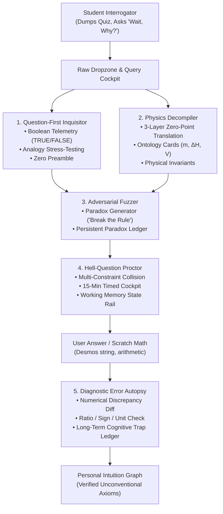
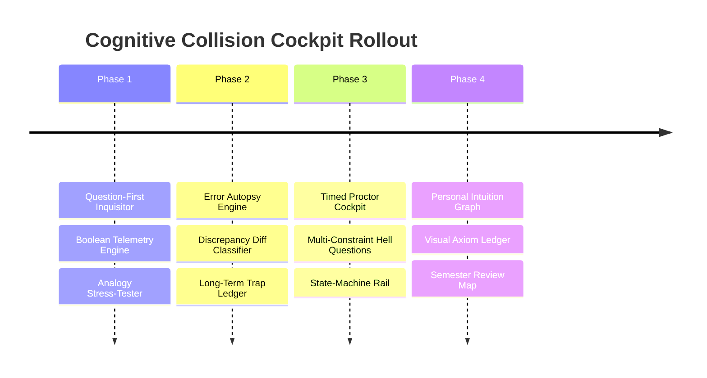

# DeepEncode: The Cognitive Collision Cockpit
## Architectural Implementation Plan & Technical Blueprint

---

## 1. Executive Summary: The Strategic Pivot

### Moving Beyond Flashcards to an Interactive Reasoning Engine
Standard study tools (Anki, RemNote, Quizlet) operate on an atomic model: $A \longrightarrow B$. For an unconventional, first-principles thinker—someone who found AP Calculus BC Unit 10 (Taylor series & convergence) intuitive because they saw it as kinematic trajectory matching—isolated flashcards are rejected as arbitrary noise.

The 500k-token study analysis revealed that actual learning occurs inside a **4-Phase Cognitive Collision Loop**:
1. **The Raw Dump & Orientation:** Immediate macro-map of governing physical rules from messy problem sets or slides.
2. **Adversarial Fuzzing ("Wait, Why?"):** Actively trying to break rules with edge cases (e.g. *"Why does Ca(OH)₂ end in -ide if oxygens mean -ate?"* or *"Why does ATP hydrolysis release energy if breaking bonds requires energy?"*).
3. **High-Pressure Timed Execution:** Proctoring multi-constraint "Hell Questions" under a countdown timer.
4. **The Error Autopsy:** Granular debugging of mathematical discrepancies (sign inversions, factor of 2 stoichiometry errors, factor of 1000 unit bugs).

This plan elevates DeepEncode from an artifact generator into the **Cognitive Collision Cockpit**: an interrogation-first software environment.

---

## 2. Architecture & Subsystem Integration

---

## 3. Detailed Component Specifications

### Component 1: The Question-First Inquisitor (`app/inquisitor/`)
* **Purpose:** Puts the user in the driver's seat as the investigator rather than a passive test-taker.
* **Input Surface:** Rapid-fire input bar accepting text hypotheses, messy problem snippets, or math formulas.
* **Protocol & Telemetry:**
  1. **Line 1: Boolean Verdict:** Instant `[ 🟢 TRUE ]`, `[ 🔴 FALSE ]`, or `[ 🟡 TRUE WITH 1 BOUNDARY TRIPWIRE ]`.
  2. **Line 2–4: Physical Invariant Proof:** Validating the unconventional intuition (e.g., why viewing Taylor Series as kinematic velocity/acceleration matching is mathematically rigorous).
  3. **Line 5: The Boundary Tripwire:** The exact edge case where the analogy breaks (e.g., $f(x) = e^{-1/x^2}$ where all derivatives at zero are $0$, yet the function is non-zero).

### Component 2: The Physics Decompiler (`lib/mr-m/decompiler.ts`)
* **Purpose:** Deconstructs superficial textbook jargon into invariant physical coordinate systems.
* **The 3-Layer Deconstruction:**
  * **Layer 0 (Textbook Jargon):** What the curriculum calls it (*"High-energy bond"*, *"Solubility chart row 4"*).
  * **Layer 1 (Coordinate Origin / Zero-Point):** Where the zero-point sits ($E=0$ at infinite separation in vacuum; displacement vs distance).
  * **Layer 2 (The Invariant Balance Sheet):** The governing conservation law (Coulomb's Law, Conservation of Charge/Energy).
* **Ontology Card Integration:** Elevates [`lib/mr-m/types.ts`](file:///C:/Users/vinso/.gemini/antigravity/scratch/Encode/lib/mr-m/types.ts#L33-L42) (`OntologyCard`):
  * Physical identity of every variable.
  * Explicit *"What It Is NOT"* warning (e.g. *mass of the water, NOT the dissolved solute*).
  * Dimensional scaling (what happens if this variable doubles).

### Component 3: The Adversarial Fuzzer ("Break the Rule" Mode)
* **Purpose:** Automates the user's natural tendency to fuzz rules like a software engineer testing an API.
* **Mechanism:**
  * The user provides a standard rule; the system returns **3 Boundary Inversions** designed to produce apparent cognitive dissonance:
    1. *The Fractional Paradox:* $\text{Fe}_3\text{O}_4$ oxidation states ($+8/3$) vs discrete electron transfers.
    2. *The Naming Anomaly:* $\text{Ca(OH)}_2$ ending in `-ide` despite containing oxygen.
    3. *The Solubility Collision:* Halides precipitate, but $\text{NaCl}$ dissolves.
  * As the user resolves each paradox, the resolution is committed to the **Paradox Ledger** ([`lib/mr-m/ledger.ts`](file:///C:/Users/vinso/.gemini/antigravity/scratch/Encode/lib/mr-m/ledger.ts)).

### Component 4: The Hell-Question Timed Proctor (`components/proctor/`)
* **Purpose:** Replaces passive flashcard review with high-pressure, multi-constraint timed problem execution.
* **Architecture:**
  * Generates a **Multi-Constraint Collision**:
    * Constraint 1: Unit / Coordinate shift ($\text{torr}$, $\text{mL}$, $\text{J}/(\text{g}\cdot^\circ\text{C})$ vs $\text{kJ}/\text{mol}$).
    * Constraint 2: Limiting reactant boundary condition with non-1:1 stoichiometry.
    * Constraint 3: Latent heat phase change plateau mid-reaction.
  * **The Proctor HUD:**
    * 15- or 20-minute real-time countdown clock.
    * Working Memory State-Machine Rail ([`StateMachineRail.tsx`](file:///C:/Users/vinso/.gemini/antigravity/scratch/Encode/components/mr-m/StateMachineRail.tsx)): Forces linear progression (State 1: System Demand $\to$ State 2: System Supply $\to$ State 3: Stoichiometric Bridge), preventing cognitive overflow.

### Component 5: The Diagnostic Error Autopsy Engine (`lib/mr-m/autopsy.ts`)
* **Purpose:** Diagnoses *why* the user's scratch math failed, instead of merely stating the correct answer.
* **The Discrepancy Classifier:**
  * Compares $A_{\text{user}}$ against $A_{\text{correct}}$:
    * **Ratio Check ($\approx 0.5, 2.0, 3.0$):** Flag `MISSING_SUBSCRIPT` or stoichiometric factor (e.g. neglected that $\text{H}_2\text{O}$ has 2 Hydrogens).
    * **Sign Check ($-X$ vs $+X$):** Flag `SIGN_FLIP` / `ORDER_INVERSION` (Products minus Reactants reversed, or $q_{\text{rxn}} = -q_{\text{soln}}$ negative sign dropped).
    * **Dimensional Scaling ($\approx 10^{\pm 3}$):** Flag `DIMENSIONAL_CONVERSION_ERROR` ($\text{mL} \to \text{L}$ or $\text{J} \to \text{kJ}$ omitted).
  * Logs the error into the **Long-Term Cognitive Trap Ledger**:
    * Tracks persistent failure patterns across the entire semester.
    * Displays pre-flight warnings before the student attempts a new problem in that domain.

### Component 6: The Personal Intuition Graph (`components/intuition-graph/`)
* **Purpose:** Replaces 100 isolated flashcards with a visual network of the user's personal, verified unconventional breakthroughs.
* **Node Schema:**
  * **Invariant Axiom:** *Taylor Series = Kinematic derivative matching at coordinate origin.*
  * **Verified Intuition:** *Convergence = Tail decay faster than geometric series $\sum r^n$.*
  * **Boundary Note:** *Smooth non-analytic functions ($e^{-1/x^2}$) where derivatives vanish at the origin.*

---

## 4. Phased Implementation Roadmap

### Phase 1: Question-First Inquisitor & Boolean Telemetry
* Build `app/inquisitor/` UI and API route with zero conversational throat-clearing.
* Implement structured prompt template enforcing the Boolean verdict, mathematical proof, and boundary tripwire.
* Support instant scratchpad pasting (Desmos formulas, raw math expressions).

### Phase 2: Diagnostic Error Autopsy & Discrepancy Diff
* Build `lib/mr-m/autopsy.ts` discrepancy classifier with numeric and AST comparison.
* Hook into existing `lib/mr-m/trap-card.ts` and `TRAP_IDS` (`sign_flip`, `missing_subscript`, `factor_of_two`, etc.).
* Connect autopsy reports to the persistent Trap Ledger in `lib/mr-m/ledger.ts`.

### Phase 3: Hell-Question Timed Proctor Cockpit
* Build `components/proctor/HellProctorModal.tsx` with a countdown clock and multi-constraint problem synthesizer.
* Integrate `StateMachineRail.tsx` to lock intermediate states and scaffold working memory during complex multi-step problems.

### Phase 4: Personal Intuition Graph & Decompiler Integration
* Extend `components/mr-m/` with an interactive Node-Link graph displaying verified mental models and resolved paradoxes.
* Provide an end-of-semester "Axiom Review Mode" where the student reviews their 15 core mental breakthroughs rather than hundreds of disjointed flashcards.

---

## 5. Verification & Safety Guarantees

* **Zero Regressions:** All 872 existing unit tests must remain 100% green.
* **Separation of Concerns:** Does not disrupt existing RemNote/Anki export pathways; acts as the primary interactive cockpit.
* **Performance:** Instant sub-second response times for scratchpad math evaluation and discrepancy classification.

---

## 6. The five limits this pass answers — and where each one stops

Written after the pass that went back over the cockpit's own arithmetic, its
breadth gate, its clock and its claim handling. Five limits were named against
the cockpit as it stood. Four of them were code that changed here; the fifth is
a property of the approach, and no amount of code removes it. Each is recorded
with its own stopping point, because a limit that is written down is a limit the
next pass can find.

### 6.1 The autopsy's vocabulary was chemistry and metric slips

**What was wrong.** The numeric half of the discrepancy diff searched for a
factor of two, three orders of magnitude and a pure sign inversion, and the
structural half's formula extractor matched a chemical element regex. A valence
factor of three (`3 A → B`), a dropped power (`r²` read as `r`), a dropped
logarithm (`ln 2 = 0.6931` in `t½ = ln 2 / k`) and a calculus answer such as
`f′(x) = 1 / (2√x)` therefore all survived the diff un-named and fell back to
prose.

**What this pass does.** The vocabulary in `lib/mr-m/autopsy.ts` is now
arithmetic rather than chemical. A factor of two keeps its own name, and it is
joined by any whole factor from three to twelve (named as a word, so a factor of
seven is not described as a factor of three), the whole powers (4, 8, 9, 16, 25,
27, 32, 64, 81, 125, 243), the two logarithm constants a wrong answer lands on
(`1 / ln 2 = 1.4427` and `ln 10 = 2.3026`), the three-orders-of-magnitude
conversion and the pure sign inversion. Every ratio is folded onto its
magnitude, so the same slip reads the same from either direction. One table
(`shapeOf`) serves both the ranking and the naming, so the pair that leads the
diff and the name printed over it cannot disagree about one number, and the
material decides the ambiguous case: a whole power *with* a law in the text
(`r²`, `r^4`, "squared", "cubed") is an exponent problem, the same number with
no law anywhere is read the conservative way as a dropped coefficient, and a
whole power above the coefficient ceiling is named as a power whether or not the
material spells the law out. The existing structural layer (`classifyTrap` in
`lib/mr-m/diagnostics.ts`) still fires first when it can, because a sentence the
learner wrote on purpose is stronger evidence than an inference from their two
numbers.

That structural layer is widened with the numeric one, because it is the file
the limitation was observed in. The taxonomy gains `whole_factor_off`,
`power_law_dropped` and `logarithm_dropped`; `detectNumeric` reads the same
shapes in the same tiers (a sign inversion above every magnitude shape, a power
with its law in the material above a whole factor, and a whole power with no law
anywhere named one tier lower rather than left silent); and the extractor is no
longer chemistry-shaped — `poweredSymbols` reads the exponent written ON a
symbol (`r²`, `x^4`, `√x`) instead of matching an element regex, so a symbolic
line such as `f′(x) = 1 / (2x)` against `f′(x) = 1 / (2√x)` is named as a
dropped exponent, with the division shown when both lines carry a number to
divide. A preceding digit counts as a boundary there, which is what makes a
coefficient flush against the symbol (`2x`) visible while `H2O` still does not
read as a mention of `H`.

**What it does not solve.** An integration constant is not a ratio, so no pair
of numbers can name it, and this layer does not pretend to — that class of error
stays with the prose. A whole power with no exponent written anywhere in the
material is named as a coefficient, which is the honest reading and also the
wrong one when the learner's material simply never wrote the law down. The
symbolic rule speaks only for an answer that carries no measured quantity
(`quantityNumbers` drops a bare small integer as a coefficient, so a
coefficient-sized pair like 4 and 16 reaches it through the structural layer
rather than the numeric diff); it names the notation and the exponent, and it
never claims a corrected value.

### 6.2 Boss fusion demanded a second chapter the material might not have

**What was wrong.** Boss level fires after two consecutive clean wins and hands
the fusion row's collision to the generator, whether or not the learner's
material actually carries the chapters being collided. Fed one isolated lecture,
the failure modes are the two this table exists to prevent: a collision topic
the learner has never met, or a single-chapter problem wearing distractor words.

**What this pass does.** `lib/escalation/fusion.ts` measures the material's
breadth before any collision is served. `fusionReadiness` counts how many of the
row's own topics the learner's material carries, matching on the distinctive
words of each topic's own name, and a collision needs **two or more** present. It
searches the topic the learner named *and* the source context, because a learner
who types "calorimetry" while their notes cover formation enthalpies does have
the second chapter. With one chapter present the escalation is not cancelled and
it is not faked: `soloDepthBrief` re-aims the load *deeper* inside the chapter
the learner actually has — break the easy version's 1:1 and unit-value
assumptions, require the same quantity from two constructions that must agree,
make one stated constraint a true but unneeded distractor — and says in the
prompt that no collision was invented. Both `/api/mutation` and `/api/crucible`
read the same readiness, and both return which mode was used (`collision`,
`depth` or `siloed`) with the one-line reason, so a re-aimed escalation is
visible to the learner rather than silent.

**What it does not solve.** Presence is vocabulary overlap, so a chapter the
material carries only implicitly — as a symbol, or as an equation with no prose
around it — can be missed and the escalation re-aimed when a collision was
available. A row is still a hand-written entry in the matrix, so a topic with no
row is served single-topic rather than fused, and the counting says nothing
about whether the learner has *mastered* a chapter, only that it is in their
material.

### 6.3 The synthesizer had no CAS behind it

**What was wrong.** Tier 3 multi-physics problems are generated from scratch, and
a language model has no symbolic engine behind it. Its prose can be coherent
while its numbers are not — an exothermic reaction whose stated heat cannot raise
the stated mass of water as far as the problem says, an expanding gas whose work
does not match the pressure and volume change it declares. Nothing in the prose
reveals that, and under a clock the learner spends the rep proving the problem is
wrong.

**What this pass does.** `lib/escalation/consistency.ts` is the sandbox the
prompt is not. A generator that wants its problem served must declare its
arithmetic: every quantity with its signed value and unit, and every relation
between them as an equality in those symbols. Each relation is then evaluated
here by a small recursive-descent evaluator that knows `+ - * / ^`, parentheses,
numbers and declared symbols and nothing else — `eval` is not used and would not
be acceptable, because a model-supplied string is untrusted input. Two kinds of
check come out of it: **closure** (both sides agree inside the tolerance; no
undeclared symbol; no division by zero) and **plausibility** (a mass or volume is
positive, a temperature is on the thermodynamic scale, water at or past its
boiling point carries a latent-heat term, work done by an expanding gas is
negative). `ok` and `verified` are separate flags on purpose: a payload that
declared no arithmetic is *unverified*, not inconsistent, and a caller that
cannot tell those apart either waves unverified problems through or refuses
everything a weaker model writes. `/api/mutation` allows one repair pass carrying
the measured defects, then refuses — and at Tier 3 it refuses an *unverified*
variant as well, because an uncheckable multi-physics problem under a clock is
worse than a hard one. `/api/crucible` drops the problems that fail, makes one
repair pass, and either paces what survived or refuses with
`inconsistent-numbers`; an accepted sprint reports how many of its problems were
machine-checked.

**What it does not solve.** It verifies what the model *declared*. A number the
model never related to anything cannot be reached, and a relation stated wrongly
and self-consistently still closes. It is not a solver and cannot name the right
exponent for a law the generator got wrong — that stays with the prompt and the
Tier 3 gates in `lib/escalation/mutation.ts`. The plausibility rules are the ones
that hold without a domain model, so an inconsistency that lives inside the
declared relations' own scope can close arithmetically and still be physically
odd. And a ledger is only as complete as the generator makes it: the check covers
the arithmetic that was declared.

### 6.4 The clock punished typing, which is not the bottleneck it trains

**What was wrong.** Three multi-step problems in twelve minutes is roughly four
minutes each, and in an exam room that time is spent scribbling on paper and
bubbling an answer. In the sheet it was spent typing chemical equations, unit
labels and multi-line derivations under a countdown — a keyboard bottleneck
wearing the costume of the cognitive one the rep exists to train.

**What this pass does.** Each state row in
`components/crucible/CrucibleModal.tsx` now carries one **optional** numeric
checkpoint slot (a small mono input, `crucible-checkpoint-<index>`, decimal
keyboard), and nothing about the sprint requires it. Advancing a state, cutting a
problem, skipping a problem and the elapsed-time stamping are untouched, so a
learner who types nothing runs the whole sprint exactly as before and whether a
checkpoint was typed cannot affect a state's recorded time. The setup panel and
the row controls each state the rule in one line, and the summary appends a typed
checkpoint only when one exists, so the closing table is byte-for-byte what it
was when nothing was typed. A new sprint starts with an empty set.

**What it does not solve.** A checkpoint is pacing information, not a score. The
sprint still reports where the clock went rather than whether the answer was
right, and it cannot check the number: there is no answer key, so the slot is a
note-to-self the learner brings back to their own paper. And wall-clock time
still includes reading and deciding, which is a different rep from bubbling an
answer in ninety seconds — the checkpoint removes the requirement to type, not
the difference between the two rooms.

### 6.5 The inquisitor refused "it depends"

**What was wrong.** Two problems, one verdict set. The closed three-verdict
taxonomy has no way to record a claim whose truth is conditional, so
"elevated cortisol causes immunosuppression" — true chronically, false in the
acute window — had to be forced into a boundary tripwire. And a `claim` field
allowed to restate a vague input meant an observational claim could come back as
a subtly different sentence, with the learner graded on a sentence that was not
theirs and a conditional claim with nowhere to put its condition.

**What this pass does.** The three verdicts stay exactly as they are, and "it
depends" is expressed as a **named context axis** rather than as a hedge.
`lib/inquisitor/contract.ts` gains `contextAxis`, required whenever the read is
context-dependent, and the prompt asks for a *pair* of regimes (acute versus
chronic, low versus high, above versus below, in vitro versus in vivo) while
refusing a hedge or a bare one-word axis, because a one-word axis is not an axis.
`lib/inquisitor/parse.ts` holds the gate (`hasContrastingAxis`, refusal
`noContextAxis`) and it runs *before* the tripwire downgrade, since downgrading a
context-dependent read to `TRUE` would hide the very condition the read is
about; an axis on a read that is not the bounded verdict is stripped, mirroring
the tripwire rule. Claim fidelity is the second half: `claimsMatch` compares the
sentence the model actually verified against the learner's own (content-word
containment with stop-words removed) and a verdict about a different sentence is
refused as `claimDrift`, on the route's side of the boundary as well as in the
client. In the sheet the learner's own sentence anchors the panel
(`inquisitor-claim-echo`), a differing interrogated sentence is labelled as a
restatement (`inquisitor-restatement`) rather than substituted in silently, and
an accepted axis renders as `[ CONDITIONS ]` under the tripwire.

**What it does not solve.** The axis is a pair of regimes named in words, not an
ontology: it carries no thresholds, no units and no membership test, so "low
versus high" is as precise as the read gets and nothing downstream can decide a
third case from it. Fidelity is a content-word comparison, not semantics — a
restatement that keeps the learner's words while inverting their relation still
matches. And a claim that is conditional in a way the model does not notice is
still answered as if it were unconditional, because the gate can only check the
axis the model returned.

---

## 7. Implementation status

Written after the first pass, so the plan and the code do not drift apart. Three
of this document's engines turned out to be built already, in the course of the
Mr M work — and saying which is more useful than pretending they shipped here.

### Shipped in this pass

**Component 1 — the Question-First Inquisitor** (`lib/inquisitor/contract.ts`,
`lib/inquisitor/parse.ts`, `app/api/inquisitor/route.ts`,
`components/InquisitorModal.tsx`). One claim in; one of three verdicts out, on
the first token: `TRUE`, `FALSE`, `TRUE_WITH_BOUNDARY_TRIPWIRE`. The proof names
the governing law and either derives the claim from it or shows where the
derivation fails; a `FALSE` cannot arrive without the construction that does
hold. Two refusals are load-bearing rather than defensive, and both are
enforced in code, not just asked for in the prompt:

* a **tripwire verdict with no tripwire is downgraded to `TRUE`** and the panel
  says so — the only way to "repair" it is to invent the boundary, and a learner
  who believes their intuition has a known limit when nobody has found one is
  worse off than one who believes it is simply true;
* a verdict **with no proof is refused outright** (HTTP 422 carrying the reason)
  rather than rendered, because an unsupported claim about rigour is a coin flip
  that got lucky.

The claim is quoted back above the verdict, so a misreading is visible instead
of hidden.

**The paradox half of Component 3's mechanism.** A boundary tripwire is a live
contradiction for this learner — the claim holds *and* there is a named case
where it does not — so it can be committed to the ledger this document already
pointed at (`lib/mr-m/ledger.ts`), which holds it open until a sentence closes
it. Committing is the learner's click, never automatic, mirroring the autopsy's
rule that the learner declares their own confidence. Opening the cockpit also
pre-flights what the topic has already caught them on, trap cards included — the
"pre-flight warnings before the student attempts a new problem in that domain"
from Component 5.

### Already existed before this pass

* **Component 5's discrepancy classifier** is `classifyTrap` in
  `lib/mr-m/diagnostics.ts`: the ratio, sign, magnitude and unit signatures, the
  subscript and operand-order rules, with the arithmetic computed in code rather
  than by the model. Its trap taxonomy (`TRAP_IDS`) and the autopsy→card builder
  (`lib/mr-m/trap-card.ts`) exist too, along with the autopsy panel.
* **The paradox ledger** (Component 3's persistence) is `lib/mr-m/ledger.ts`.
* **The state-machine rail** (Component 4) is `components/mr-m/StateMachineRail.tsx`.
* **The 3-layer zero-point translation** (Component 2) is the `axiomFirst`
  payload in `lib/mr-m/types.ts` (`governingLaw`, `coordinateOrigin`,
  `zeroPoint`), asked for by the encode directive and surfaced by
  `AxiomFirstPanel`. What this plan calls a separate `decompiler.ts` would be a
  second name for the same three layers.

### Not built, and deliberately

* **Component 4, the Hell-Question timed proctor.** A countdown clock plus a
  multi-constraint synthesizer is its own surface with its own timing and
  interruption semantics; the rail it would reuse already exists. Next pass.
* **Component 6, the Personal Intuition Graph.** An interactive node-link map of
  verified axioms and resolved paradoxes is a rendering subsystem, not an
  extension of anything here.
* **Component 2's `decompiler.ts` as a standalone module.** The three layers are
  already shipped as the `axiomFirst` payload; adding a parallel module would
  split one concept across two names.
* **Component 3's automatic fuzzing** ("give me 3 boundary inversions for this
  rule"). The ledger half is shipped; a second generator for it would duplicate
  the inquisitor's boundary path, so it belongs in the same contract if it is
  wanted — one claim at a time is what the surface is built around.

### Verification

Unit tests pin the contract and every refusal (`tests/unit/inquisitor.test.ts`),
including that a held boundary becomes an unresolved ledger entry and that
re-committing the same boundary updates that record instead of stacking copies.
The browser spec (`e2e/inquisitor.spec.ts`) drives the real sheet: the verdict
and its law on screen, the boundary rendered, a committed boundary still open
after the sheet is closed and reopened, a false read showing its fix, and a
refused read reported as a refusal rather than rendered.

## 8. Implementation status: Phases 2–5

Written after the adaptive-escalation pass. This document's Component 4 (the
timed proctor) and Component 5 (the autopsy engine) are the same two builds the
later "Adaptive Escalation, Timed Crucibles & The Error Autopsy Engine"
specification describes, so they are recorded here rather than in a parallel
document: §7's "not built, and deliberately" no longer applies to either.

### The Error Autopsy (Component 5, Phase 2)

`lib/mr-m/autopsy.ts` answers *which line of the mental compiler threw the
exception*, and it is deliberately two-layered. The structural layer is the
shipped `classifyTrap`; the numeric layer is new — every quantity in the
expected answer is crossed against every quantity the learner wrote, each ratio
is folded onto its magnitude so a factor of two reads as `2` from either
direction, and the shape is named — 2, any whole factor from three to twelve, a
whole power, one of the logarithm constants, 1000, or a pure sign inversion
(§6.1 records the widening and where it stops).

Two rules carry the engine. **Arithmetic is never asked of a model**: `0.0336 ÷
0.0168 = 2.00` is computed in TypeScript from the learner's own numbers
(`app/api/autopsy/route.ts` runs on the checker slot, and only ever writes the
narrative). And **no clean signal means no diagnosis**: a fracture that survives
neither layer returns `null` and the panel says nothing, because an invented
diagnosis is exactly the arbitrary noise this mode exists to remove. A sign
inversion sits a tier above every magnitude shape, so precedence is a property
of the taxonomy rather than of crossing order.

Patches are persisted in `lib/mr-m/ledger.ts` as an extension of the paradox
ledger: the same fracture on the same topic **re-opens its record and
increments `hits`** instead of stacking a near-duplicate, which is what lets a
pre-flight warning state how many times the fault has actually fired. Only a
repeat warns (`REPEAT_HITS`), capped so the strip stays readable, and only
against the topic the next attempt is really timed against.

### The Constraint-Mutation Matrix (Phase 3)

`lib/escalation/mutation.ts` holds the three tiers and the deterministic gates
that decide whether a generated variant is actually the tier it claims. Beyond
numerical substitution, the mutations are structural: unequal stoichiometric
ratios, a non-unit density that makes `m_solute` and `m_solution` disagree, and
at Tier 3 a phase change with its latent-heat term and boundary work. Tier 2 is
a **quorum** — two of its three moves is the tier, and the individual moves are
reported but not demanded — which is why "is this Tier 2" has exactly one
answer. Tier 3 is refused in both directions: a variant that treats a phase
change as a plain `ΔT` fails the latent-heat and boundary checks, and the
refusal names the requirement rather than saying the model ignored the
directive. Strong model, because the numbers have to stay physically valid.

### The Timed Crucible (Component 4, Phase 4)

`components/crucible/CrucibleModal.tsx` fronts `app/api/crucible/route.ts`. The
model writes the problems and declares each *state*'s weight; it never
touches the clock. `lib/crucible/budget.ts` allocates the sprint across those
weights by the largest-remainder method, so the HUD's targets are whole seconds
that sum to exactly the clock it is pacing, and the pacing bands are compared on
integer percents — `1 - 0.2` is not exactly `0.8` in binary floating point, and a
flag that disagrees with the arithmetic it prints is worse than no flag. The
summary reports where the clock went and, separately, how much of an overrun was
recovered, because recovering under load is the skill the rep trains. It never
reports speed as a grade. The client re-runs the same coercion the route does, so
a payload that is not a state machine is refused rather than paced. A sprint that
is run to the END of every state of every problem is recorded as one friction
attempt — scoped to the topic it was timed against, no rungs (there are none
under a clock), and the sprint’s own declared minutes as the expectation — so the
rep feeds the governor; a sprint that is cut short records nothing.

### The ZPD Governor, Concept Fusion and the Emergency Triage Buffer (Phase 5)

`lib/escalation/governor.ts` escalates on two consecutive **clean** wins — solved
with no clue rung requested — and a miss zeroes the streak rather than pausing
it, because a failure is direct evidence that the difficulty is not too low.
The decision is returned with its reason and rendered, since a difficulty knob
the learner cannot see is indistinguishable from a bug. Two surfaces feed it, and
they are not equals: the workbench’s examiner check, where the answer is graded
and the rung count is real, and a crucible sprint run to completion, which
reports a completed rep and what it cost against the sprint’s own budget rather
than a correctness read.
`lib/escalation/fusion.ts` supplies the cross-chapter collision the boss level
is briefed with. `lib/crisis/buffer.ts` and
`components/crisis/EmergencyTriageModal.tsx` are the night everything is due at
once: a freeze is only offered when the marginal grade risk can be shown, the
panic is dismantled with the weighted-average arithmetic, and an item with no
stated weight is listed as withheld with what would make it decidable instead of
being guessed at. The runway renders one task for ninety minutes.

### Model routing

The split §2 already describes is used literally: the checker slot
(`geminiCheckerModel`) reads claims, decomposes a problem into a skeleton, reads
a panicking dump (`/api/crisis`) and writes the autopsy narrative
(`/api/autopsy`); the strong slot (`geminiModel`) synthesizes clue rungs,
boss-level collisions and constraint-mutated problems (`/api/mutation`,
`/api/crucible`); and all arithmetic — ratios, grade risk, clock allocation,
pacing — happens in TypeScript. A route asks for a slot with `isChecker` and the
resolver in `lib/ai-client.ts` owns the rest, including its own default and
model fallback chain, so no route hardcodes a model name.

### The gates added by the limits pass (§6)

All five are shipped, and each one is a refusal rather than a repair wherever a
refusal is the honest answer:

* **`lib/escalation/consistency.ts`** — the declared-ledger gate: the
  recursive-descent evaluator, the closure and plausibility rules, the split
  between `ok` and `verified`, and the one-line defect report the repair pass is
  handed. `/api/mutation` allows one repair pass and then refuses (422), and
  refuses an unverified Tier 3 variant outright; `/api/crucible` drops the
  problems that fail, repairs once, and either paces the survivors or refuses
  with `inconsistent-numbers`, reporting how many problems were checked.
* **`lib/escalation/fusion.ts`** — `fusionReadiness` and `soloDepthBrief`: a
  collision is served only when two or more of the row's chapters are measured
  present in the material, and one chapter is met with a re-aimed escalation
  *deeper* inside it that says so in its own brief. Both routes return
  `escalation: { mode, reason }` so the choice is visible.
* **`lib/mr-m/autopsy.ts`** — the signature table is arithmetic (whole factors
  three to twelve, whole powers, the logarithm constants, the conversion, the
  sign inversion), one `shapeOf` table serves both the ranking and the name, and
  the material decides whether a whole power is an exponent or a coefficient.
* **`components/crucible/CrucibleModal.tsx`** — the optional per-state
  checkpoint, with the copy that says the sprint is paced on the step and that
  nothing under the clock requires typing.
* **`lib/inquisitor/contract.ts` + `lib/inquisitor/parse.ts`** — the context
  axis (a required pair of regimes for a context-dependent read, gate
  `noContextAxis`, checked before the tripwire downgrade) and the claim-fidelity
  gate (`claimsMatch`, refusal `claimDrift`), with the learner's own sentence
  anchored in the sheet and any restatement labelled as one.

### Verification

`tests/unit/escalation-consistency.test.ts` pins the evaluator (precedence,
right-associative powers, undeclared symbols, division by zero returning null),
every plausibility rule, and the `ok`/`verified` split. The extended
`tests/unit/mr-m-diagnostics.test.ts`, `tests/unit/mr-m-autopsy.test.ts` and
`tests/unit/escalation-fusion.test.ts` cover the widened vocabulary and the
breadth gate. The suites that predate this pass keep pinning their own gates:
`tests/unit/mr-m-ledger.test.ts` (the patch half), `tests/unit/escalation-mutation.test.ts`,
`tests/unit/escalation-governor.test.ts`, `tests/unit/escalation-fusion.test.ts`,
`tests/unit/crucible-budget.test.ts` and `tests/unit/crisis-buffer.test.ts` pin
every gate and every refusal. `e2e/cockpit-escalation.spec.ts` drives the two new
sheets in the browser: the state-by-state time budget, the pacing read, the
pre-flight tripwire drawn from a real patch ledger (with a single-hit slip
staying silent), a sprint that is not a state machine refused instead of
rendered, and the freeze → arithmetic → ninety-minute runway flow.

## 9. Eight things the first two passes said and did not do

Each pass so far ended by naming what it had left open. These eight are drawn
from those lists, read against the code rather than against the prose, and every
one of them is a place where the app said something the server did not do, knew
something it never said, or threw away a decision it had already made.

### 9.1 The consistency gate refused correct physics

**What was wrong.** The evaluator knew only `+ - * / ^`, parentheses, numbers and
declared symbols. `ln`, `log`, `exp`, `sqrt` and the trigonometric ratios were
read as UNDECLARED SYMBOLS, so a completely correct Arrhenius rate law
(`k = A · exp(-Ea / (R · T))`), a Nernst potential or a Henderson–Hasselbalch line
made its relation unevaluable, the closure check failed, and `/api/mutation` and
`/api/crucible` refused an honest problem with `inconsistent-numbers`. Refusing
correct physics is the worst failure this gate can have: it is invisible in the
prose, it looks like rigor, and it teaches the learner that the clock is not
trustworthy.

**What this pass does.** The evaluator gains a closed function table — `ln`,
`log` (base 10, with `log10` as an alias), `exp`, `sqrt`, `abs`, `sin`, `cos`,
`tan` in radians — and two constants, `pi` and `e`. Every function is arity 1 and
returns a non-finite value outside its real domain, which the evaluator already
treats as “could not be evaluated”, so `ln(0)`, `sqrt(-1)` and `1 / ln(1)` are
refused rather than closing on an infinity. A name outside the table is not
callable, so `q(2)` does not quietly become a multiplication, and a declared
quantity outranks a constant of the same name. Both ledger prompts now name the
vocabulary and ask for `exp(-Ea / (R * T))` rather than `e^-Ea/(R*T)`, because
grouping inside a function or an exponent is the model’s job to state.

**What it does not solve.** This is still not a solver and not a general CAS. It
evaluates what the model DECLARED, so an exponent the material never wrote down
stays invisible. The function set is a fixed list: a subject that needs `log2`,
`arcsin` or a two-argument `log` is refused rather than mis-evaluated. Angles are
radians, so a mechanics problem that quotes degrees has to convert them itself.

### 9.2 A backup did not contain the patch registry, or the friction log

**What was wrong.** `buildBackup()` collects a named list of feature stores and
`restoreBackup()` writes back exactly that list. Two live stores were not on it:
the engineering patch registry (`deepencode_mr_m_patches_v1`, the standing faults
the pre-flight warning is drawn from) and the ZPD friction log
(`deepencode_friction_log_v1`, the clean-win streak the boss level is decided
by). BACKUP EVERYTHING therefore restored an empty registry and a zeroed streak
on another device — the same silent loss the feature exists to prevent.

**What this pass does.** Both keys join the list, which is the fix in both
directions by construction: collect and restore read the same constant. A unit
test seeds both stores, builds the backup, clears storage, restores, and asserts
both came back — naming the two key strings literally, so renaming a store
anywhere breaks the test rather than the backup.

**What it does not solve.** The entries are stored verbatim, including a
`statement` the learner has rewritten — which is the point, and also the reason
there is nothing minor-versioned here to migrate if a record’s shape changes
later. An older backup only restores what its own version knew about.

### 9.3 The claim-fidelity gate refused restatements

**What was wrong.** `claimsMatch` compared raw content words, so `bond` did not
match `bonds`, `breaks` did not match `breaking`, `dilutes` did not match
`dilution`. On a short claim the overlap fell under the 0.8 threshold and a
legitimate echo of the learner’s own sentence was refused as `claimDrift` — the
gate firing on spelling rather than on drift.

**What this pass does.** The comparison is made on stems: a small documented
irregular table (`break`/`broke`/`broken`/`breaking`, `lead`/`led`,
`bind`/`bound`, …), then one suffix stripped longest-first with a four-character
floor, then a trailing silent `e` dropped. The threshold, the direction of the
containment test and every exported signature are unchanged; the revealed pair
from the report now matches, and two honesty tests keep the gate real — a claim
whose echo answers a different question is still refused, and a short claim still
needs 80% of its own stems echoed.

**What it does not solve.** Clipping is not lemmatising. A synonym (`break`
against `fracture`) is not a match, and the reported pair passes at exactly 0.8 —
the floor, not a comfortable margin. The rule is deliberately conservative in
that direction: a gate that accepts a paraphrase will accept an answer that
replaced the claim.

### 9.4 The triage plan and the runway died with the sheet

**What was wrong.** The parsed plan and the ninety-minute runway lived only in
React state, so closing the sheet, pressing Escape or reloading forty-five
minutes in destroyed both: the learner re-pasted the whole backlog and re-ran
triage from scratch.

**What this pass does.** `lib/crisis/buffer.ts` encodes a record — the dump as
typed, the plan rebuilt field by field, the runway’s START epoch, its own
duration and a `savedAt` stamp — and decodes it totally: absent, non-JSON,
wrong-shaped and implausible records all come back `null` and the sheet opens as
a first visit. The runway stores a start epoch rather than a countdown because
the runway is wall-clock: an hour away from the tab is an hour of it either way,
and a resumed countdown would be a lie about time already spent. A record whose
ninety minutes are gone returns as the PLAN with an explicit expired note and the
offer of a fresh runway — never as a silently renewed clock. It is read in a lazy
initializer on the mount that the opening click causes (the sheet is mounted only
while it is open), so nothing touches storage during a server render and no empty
sheet is painted before the resumed one.

**What it does not solve.** The record is modal-local and device-local: it is not
synced, so another browser is still a fresh night. The plan is trusted only as
far as the codec that rebuilt it, so a record written by an older shape is
discarded rather than migrated.

### 9.5 Pre-flight warnings only existed under a clock

**What was wrong.** `preflightWarnings` had exactly one caller: the timed
crucible’s setup screen. The standing faults the registry had recorded for a
topic were therefore invisible in the workbench — where most of the work happens
— unless the learner happened to start a sprint on that exact topic.

**What this pass does.** The workbench draws the same list through the same rule
the registry exposes to a panel it already handed its patches to (`warningsFrom`:
a fracture must have fired at least twice, newest-first, capped), renders it above
the answer fields, and recomputes it from the state a recorded patch already
updates — so a fracture recorded in the session appears without a reload.

**What it does not solve.** It is the same vocabulary-overlap match the crucible
uses, and it is a warning rather than a gate: it never blocks a stage.

### 9.6 Interactive templates could not record a patch

**What was wrong.** The registry was fed only from the examiner block in
`app/page.tsx`, which needs numbers typed into `field1`/`field2`/`field3` and Mr M
mode on. The Parsons drill types nothing, so a wrong chain — the one case where
the app knows the canonical order and the learner’s own order exactly — produced
no record at all.

**What this pass does.** `diagnoseSequence` in `lib/mr-m/autopsy.ts` turns a
positional grade into the same `DiscrepancyReading` the numeric path returns
(`ORDER_INVERSION`, trap `reversed_order`, origin `structural`, terms empty),
reusing the drill’s own fix line through `describeParsonsFix` so the moved link
is named by one implementation rather than two. `CausalSequence` reports its
grade through a new optional callback, and the workbench records it exactly where
the examiner does — topic, scaffold statement, reveal, and `null` learner and
expected values, because nothing numeric was measured — then re-reads the
registry so the armory and the new strip see it.

**What it does not solve.** Only the ordering drill has a canonical structure to
grade against. A discrimination-gate miss keeps its own, richer record (the
learner’s own rule, saved as a trap card) rather than a patch kind invented to
fill the gap, and a perturbation slider has no wrong position to diagnose; those
surfaces stay silent on purpose, and the comment beside the handler says so.

### 9.7 The boss banner promised a collision the sprint did not contain

**What was wrong.** The setup screen set its fusion state from `matchFusion` —
the ungated row lookup — and never read the source context, so with one chapter
present it promised a three-chapter collision while the route had already
re-aimed the escalation deeper inside that chapter.

**What this pass does.** The banner is decided by `fusionReadiness` for the same
topic and context the route is sent, and once a sprint has been served it prefers
the route’s own `escalation.reason`. It renders the readiness `reason`, which the
module documents as the one line meant for the learner — deliberately NOT
`soloDepthBrief`, which is the generator’s prompt, and pasting an instruction to
the model onto a setup screen would be a new lie in the other direction.

**What it does not solve.** Presence is still vocabulary overlap (§6.2, §9.5),
and the banner can only be as honest as the client’s own context, which is the
notes text rather than the whole library.

### 9.8 The gate results were computed, returned, and thrown away

**What was wrong.** Both routes returned the ledger verification, the problems
they dropped and the escalation mode with its reason, and no client read any of
it. §6.3’s promise that the learner could see why a problem was refused was, on
screen, false: the only trace was a boolean in a JSON body nobody opened.

**What this pass does.** The crucible summary renders a receipt — how many served
problems had their declared relations closed by a machine, which problem was
dropped and by which relation, and the escalation the problems were written for —
and renders NOTHING when the response carries no numeric ledger, because “0 of N”
would be a claim about a check that never reported. The browser suite pins all
three lines.

**What it does not solve.** The receipt reports the verdict, not the defect
report: the repair prompt’s detail still lives in the route. And the same fields
on `/api/mutation` are still unread, because the crucible is the only caller
wired in this pass — named here rather than papered over with a surface that does
not exist.

### Verification (§9)

Unit: `tests/unit/escalation-consistency.test.ts` (the closed function
vocabulary, its domains and its limits), `tests/unit/inquisitor.test.ts` (the
stemmer, the reported pair, and the two honesty tests that keep the gate real),
`tests/unit/crisis-buffer.test.ts` (round trip, eight rejections,
before/at/past expiry), `tests/unit/mr-m-autopsy.test.ts` (`diagnoseSequence`:
in-order → null, a swap, a full reversal, empty and length-mismatched input) and
`tests/unit/backup.test.ts` (the two restored stores).

Browser: `e2e/cockpit-escalation.spec.ts` (the readiness-gated banner, the
receipt’s checked/dropped/escalation lines, and the triage sheet closing on
Escape), `e2e/mr-m-mode.spec.ts` (the workbench pre-flight strip, with the
single-hit slip still silent) and `e2e/sequence.spec.ts` (a wrong chain recorded
as `ORDER_INVERSION` with `hits: 1` and no numeric value claimed, and still too
rare to warn).

## 10. The audit pass: what a topic outside the fixture actually meets

An external audit of a stale checkout reported ten limitations. They were each
re-checked against the code before anything was changed, and the result is three
kinds of entry: four were already answered by §9, four were real and are fixed
here, and the rest are design limits that this pass makes HONEST rather than
pretending to remove.

### 10.1 Already fixed in §9 (the audit was reading an older tree)

The evaluator’s missing functions (`ln`, `log`, `exp`, `sqrt`, `sin`, `cos` and
the constants `pi`/`e`), the two stores missing from the backup’s `EXTRA_KEYS`,
the claim gate’s missing stemming, and the triage plan’s missing persistence
were all shipped in §9. Their sections stand; nothing here re-litigates them.

### 10.2 Scientific notation, and implicit multiplication against a group

**What was wrong.** The tokenizer split `1.5e-3` into a number, a symbol, a minus
and a number, so every relation written in scientific notation — which is how a
generator writes a measured quantity — was refused as unevaluable, and `2(x + 1)`
was refused too. The refusal was at least honest (a wrong value would have been
worse), but it refused correct physics, which §9.1 already established as the
worst failure this gate can have.

**What this pass does.** `1.5e-3`, `6.022E23`, `2e5` and `1.5e+2` are single
numbers; an exponent marker only counts when a digit follows the optional sign,
so `2Ea` stays a number followed by a declared symbol rather than silently
becoming `2 * E * a`. `2(x + 1)` is a product, and the group is parsed as a power
so `2(3)^2` is 18 rather than 36 — implicit multiplication carries
multiplication’s own precedence.

**What it does not solve.** `2x` and a bare `2e` stay REFUSED, deliberately: a
coefficient flush against a symbol is also how a quantity and its unit are
written (`2 m`, `5 g`), and a relation that closed on the wrong product would be
worse than one refused. The evaluator still is not a CAS and still verifies only
what the model declared.

### 10.3 The workbench autopsy was split-brained

**What was wrong.** `app/page.tsx` recorded patches through
`diagnoseDiscrepancy`, whose first layer is the structural classifier and whose
second is the numeric diff (the sign inversion, the factor of two, whole factors
three to twelve, whole powers, the logarithm constants, the conversion). The
workbench called `classifyTrap` directly. So on the workbench — where the work
happens — a factor-of-three error, a dropped exponent or a dropped logarithm
rendered NOTHING in the trap-autopsy panel and left the trap-card save with a
`null` diagnosis, while the same answer produced a named, arithmetic-backed
reading in the background. The panel and the record disagreed about the same
answer.

**What this pass does.** The panel is drawn by `diagnoseDiscrepancy`, with the
same gating and the same inputs the registry uses, so the two can no longer
disagree. That required one honest type change: a `DiscrepancyReading` is not a
`TrapDiagnosis` (its `trapId` may be null, and it carries `kind`, `terms` and
`origin`), so `AutopsyDiagnosis = DiscrepancyReading | TrapDiagnosis` is now what
the panel and the card builder accept, and a reading with no trap id is headed by
its own `kind` rather than rounded onto the nearest trap label.

**What it does not solve.** The two vocabularies stay separate on purpose — a
discrepancy names an arithmetic SHAPE, a trap names a structural REASON — and a
kind with no honest trap mapping still keeps none.

### 10.4 The armory went stale during a session

**What was wrong.** The effect that hydrated `patches` depended only on the
topic, so a check that recorded a fracture left the workbench’s patch panel and
its pre-flight strip showing what was stored BEFORE the check — until the learner
changed topic and changed back.

**What this pass does.** The patch read is keyed to the check result
(`feynmanResult`, a fresh object per check, written after the examiner answers),
so a newly recorded fracture appears on the same screen that produced it. The
browser test answers a factor of three away, then asserts both the arithmetic
reveal and the new entry in the armory.

### 10.5 The streak leaked across topics, and the boss copy overclaimed

**What was wrong.** `recordAttempt` scopes a friction entry by the stage’s own
title, and the comment at that call site says why: a clean run on one chapter
says nothing about the next one. The reader ignored it — `cleanWinStreak` walked
the whole log — so one clean win on Genetics plus one on Thermochemistry made a
streak of two and escalated the next sprint on ANY topic. Worse, the sentence
that reason produced promised that “the next one collides two chapters”, which is
false for every chapter with no row in the hand-written fusion matrix (§6.2), and
it rendered directly beside the readiness line that measures the truth.

**What this pass does.** `cleanWinStreak`/`governorDecision` take the topic and
count only that topic’s entries (forgiving about case and whitespace), the
crucible recomputes the decision against the editable topic it is actually timed
against, and the governor’s sentence now claims only what the governor does — the
load is raised — leaving the collision claim to the line that can measure it.

**What it does not solve.** The fusion table is still hand-written, so most
topics get a re-aimed single-chapter escalation rather than a collision; the copy
now says so instead of implying otherwise.

**The crucible’s rep (revised).** An earlier pass left the crucible recording
nothing into the governor, on the grounds that a sprint is PACED rather than
graded and that logging one as a clean win would invent a mastery reading the
mode never took. The first half of that still holds and is still written at the
call site; the second half was wrong about the consequence. A mode whose reps
leave no trace cannot inform the difficulty of the next one — the learner runs a
full sprint and the governor still reads the chapter as untried — so a sprint
that is run to the END of every state of every problem is now recorded, scoped to
the topic it was timed against. What is recorded is exactly what the mode
measured: `rungsUsed: 0` (there is no clue ladder under a clock, so nothing could
have been asked for) and `expectedMs` set to the sprint’s own declared budget, so
the pacing ratio is a real number. `secured: true` there means “the rep was run
to the end” — the strongest read this surface takes and a weaker one than the
workbench’s graded check — and a sprint that is cut short still records nothing.

### 10.6 A model the key does not have killed the whole request

**What was wrong.** The Gemini ladder is `target → 3.6 → 3.5 → 2.5`, and only a
quota/rate-limit error fell through to the next rung. A “model not found” error
matched none of those branches, so it hit the structural throw: on a key without
the default `gemini-3.7-flash`, every generation failed outright on a model the
learner never chose. (The audit described this as three wasted round trips; the
code did not even get that far.)

**What this pass does.** A model-not-found error is classified (message-shaped,
with a numeric guard so a 429/401/5xx can never be mistaken for it), REMEMBERED
for the session, and skipped when the ladder is built — so the first call falls
through to a model that answers and every later call starts where the last one
succeeded. Quota, timeout, credential and structural errors keep their existing
behavior; an all-dead ladder is still attempted rather than replaced by an
invented error.

**What it does not solve.** The memory is per session and in-process only (no
persistence, no cross-tab sharing), and the streaming helper’s own model
resolution does not consult it yet.

### 10.7 Deliberate non-changes, and one claim the audit got wrong

* The triage sheet still traps focus and still shows one task: hiding everything
  else IS the intervention. What changed in §9.4 is that the escape hatch is now
  usable — Escape closes the sheet, and reopening it resumes the running runway
  rather than destroying it (`e2e/cockpit-escalation.spec.ts` proves the plan
  comes back, the dump does not, and the model is asked exactly once).
* `/api/crucible`’s second model call is bounded at one repair pass, fired only
  when a problem failed the arithmetic gate, and accepted only when it improves
  on the first attempt. It is a real cost, not a loop; the audit’s “frequently
  breaches the serverless timeout” is an inference, not a measurement.
* `hasContrastingAxis` already splits on `/`, and the audit’s own example
  (`pH: acidic vs basic`) already passes on `vs`. Nothing was changed there.

### Verification (§10)

Unit: `tests/unit/escalation-consistency.test.ts` (scientific notation, the
implicit group product and its precedence, and `2x`/`2e`/`2Ea` still refused),
`tests/unit/mr-m-trap-card.test.ts` (a numeric reading builds a card),
`tests/unit/escalation-governor.test.ts` (a chapter is not escalated on wins
scored elsewhere; the boss sentence no longer promises a collision) and
`tests/unit/ai-client.test.ts` (the real ladder, driven with the SDK mocked at
its boundary: a missing target falls through and is remembered, a quota error is
neither, and an all-dead ladder is still attempted).

Browser: `e2e/mr-m-mode.spec.ts` (a whole-factor error named with its arithmetic
AND appearing in the armory on the same check; the earlier structural autopsy
unchanged), `e2e/cockpit-escalation.spec.ts` (a streak earned on one chapter does
not escalate another, with `boss: false` asserted on the request that is actually
posted) and `e2e/sequence.spec.ts` (unchanged, re-run because the workbench’s
effects changed).

Tooling: `package.json` gains targeted spec scripts (`test:e2e:cockpit`,
`test:e2e:mrm`, `test:e2e:sequence`, `test:e2e:inquisitor`), and the README’s
Testing section documents the full-sweep recipe against a production build
(`build` → `start` → `PLAYWRIGHT_BASE_URL=… playwright test --workers=2`), which
`playwright.config.ts` already supports by not launching its own server when that
variable is set.
