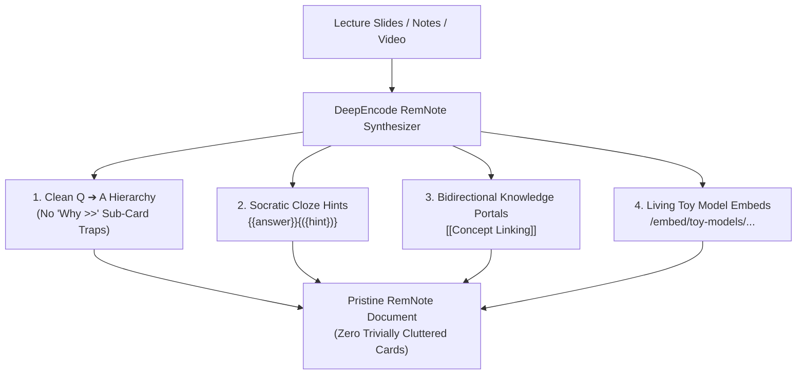
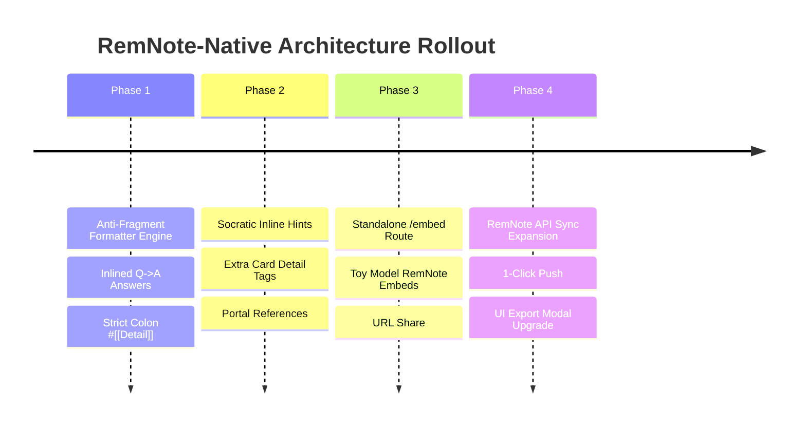

# DeepEncode: RemNote-Native Cognitive Architecture
## Implementation Plan & Design Specification

---

## 1. Executive Summary & Core Philosophy

### The Cognitive Pivot: RemNote Over Anki
While Anki atomizes knowledge into isolated, disconnected flashcards, **RemNote is an outliner-first knowledge graph where your notes *are* your cards.** In STEM, medicine, and biology, retaining the surrounding context, parent concept, and mechanistic hierarchy is essential for high exam performance.

### The Problem With Naive AI RemNote Generation
Naive RemNote generation often creates cluttered, trivial cards that ruin the flow of flashcard reviews:
1. **The Sub-Descriptor Trap:**
   ```markdown
   - SN1 Reaction
       - Confusable With >> [[SN2 Reaction]]
   ```
   *Review Front:* `SN1 Reaction > Confusable With` $\to$ *Answer:* `__________`  
   *(Tests arbitrary outline memory rather than chemistry).*

2. **The "Why >>" Fragment Trap:**
   ```markdown
   - Na+/K+ pump net ion movement? >> 3 Na+ out, 2 K+ in per ATP
       - Why >> K+ leak sets resting potential near EK
   ```
   *Review Front:*  
   `Na+/K+ pump net ion movement?`  
   `Why` $\to$ *Answer:* `__________`  
   *(Spawns an annoying second card asking a vague one-word prompt "Why" right after you answered the main question).*

### The Core Design Fix
1. **Direct Q $\to$ A Prompts (`Question >> Answer`):** Clean, unambiguous question on the front.
2. **Inlined Explanations:** Brief causal rationales are placed directly in the answer: `Question >> Answer (Reason / Context)`.
3. **Strict Colon-Only Detail (`- Label: Value #[[Extra Card Detail]]`):** Any secondary context indented under a card strictly uses a colon `:` and **never** the `>>` delimiter, guaranteeing RemNote treats it purely as context on the back of the card and **never** generates a sub-card.
4. **Promotion of Core Mechanisms:** If the "why" or mechanism is high-yield enough to test, it is promoted to a **real standalone question** (e.g. `Why does the pump export 3 Na+ for 2 K+? >> ...`).

---

## 2. The 4 Core RemNote Pillars



---

### Pillar 1: First-Class Concept-Descriptor Hierarchy (Clean Q $\to$ A)

DeepEncode transforms messy lecture slides into structured, elegant RemNote outliner markdown using the native RemNote operator set:

#### Native RemNote Operator Matrix
| RemNote Operator | Purpose | Review Behavior | Example |
| :--- | :--- | :--- | :--- |
| `::` | Two-Way Concept Card | Tests both Front $\to$ Back and Back $\to$ Front | `Action Potential :: Rapid, transient polarity reversal (-70mV to +30mV)` |
| `>>` | Direct Question $\to$ Answer | Forward-only test of cause, trigger, or mechanism | `Under what condition does substitution switch from SN2 to SN1? >> Tertiary substrate in polar protic solvent` |
| `: ... #[[Extra Card Detail]]` | Context On Card Back (No `>>`!) | Appears on parent card back; **guaranteed zero sub-cards** | `- Why: K+ leak sets potential near EK #[[Extra Card Detail]]` |
| `>>>` | Multi-Line List Card | Indented children are tested together as a bundle | `Steps of PCR denaturation >>>` |
| `>>1.` | Ordered Sequence Card | Indented children are tested in strict chronological sequence | `Phases of Mitosis >>1.` |

#### Concrete Output Specification (Zero "Why >>" Traps)
```markdown
# 🔬 Cell Biology: Membrane Electrophysiology

- Action Potential :: Rapid, transient polarity reversal (-70mV to +30mV) across excitable membranes
    - What exact threshold triggers all-or-none firing? >> Depolarization to -55 mV opening voltage-gated Na+ channels
    - What closes at the +30 mV peak to initiate repolarization? >> Voltage-gated Na+ channel inactivation gate
    - How does an action potential differ from a graded potential? >> Action potentials are all-or-none and non-decremental; graded potentials decrement with distance
        - Reference: [[Graded Potential]] #[[Extra Card Detail]]
    - What-If: Effect of Tetrodotoxin (TTX) block >> Blocks voltage-gated Na+ channels, eliminating depolarization entirely
        - Clinical correlation: Pufferfish poisoning causes respiratory paralysis #[[Extra Card Detail]]

- What is the net ion movement of the Na+/K+ ATPase pump per ATP? >> 3 Na+ exported out and 2 K+ imported in (maintains negative resting potential near EK)
    - Mechanism details: Phosphorylation by ATP induces conformational shift from E1 to E2 state #[[Extra Card Detail]]
    - Traps: Do not confuse with Na+/Ca2+ antiporter or passive K+ leak #[[Extra Card Detail]]

- Why does the Na+/K+ pump export 3 Na+ for every 2 K+ imported? >> To generate a net negative intracellular charge and counteract continuous outward K+ leak
```

> [!IMPORTANT]
> **The Strict Anti-Subcard Rule:**  
> Indented children under a card MUST use a colon (`:`) and `#[[Extra Card Detail]]`. They must NEVER use `>>`. This completely eradicates:
> * `Question > Why >> _____`
> * `Question > Traps >> _____`
> * `Concept > Confusable With >> _____`

---

## 3. Pillar 2: Socratic Cloze Syntax Optimization (`{({hint})}`)

RemNote possesses a unique active-recall feature that Anki lacks: **Inline Hints** via `{{answer}}{({hint})}`.

#### How It Works
DeepEncode automatically converts Socratic clues, dimensional cues, and memory hooks generated by the AI into native RemNote hints:

```markdown
- The resting membrane potential is maintained primarily by {{K+ leak channels}}{({which ion has the highest resting permeability?})}.

- In Michaelis-Menten kinetics, when [S] = Km, the reaction velocity is exactly {{Vmax / 2}}{({half-maximal saturation})}.

- Under physiological conditions, the Na+/K+ ATPase pump exports {{3 Na+}}{({moves out})} for every {{2 K+}}{({moves in})} imported per ATP hydrolyzed.
```

#### Review Experience in RemNote
During study, RemNote displays:
```
The resting membrane potential is maintained primarily by [ 💡 which ion has the highest resting permeability? ].
```
The student gets the pedagogical scaffolding they need to retrieve the memory without giving away the answer.

---

## 4. Pillar 3: Bidirectional "Confusable Pair" Portals (`[[References]]`)

RemNote's biggest differentiator is its interconnected knowledge graph. When DeepEncode analyzes a lecture deck and detects lookalike concepts with overlapping features, it links them using `[[Concept References]]` with direct questions rather than trivia tags.

#### Template Pattern
```markdown
## ⚖️ Lookalike Discrimination: SN1 vs SN2 Mechanisms

- Under what substrate & solvent conditions does a substitution switch from SN2 to SN1? >> Tertiary substrate (carbocation stability) + polar protic solvent favors [[SN1 Reaction]]; primary substrate + polar aprotic solvent favors [[SN2 Reaction]].
    - Discrimination Matrix: #[[Extra Card Detail]]
        - SN1 Rate Law: rate = k[R-X] (unimolecular) #[[Extra Card Detail]]
        - SN2 Rate Law: rate = k[R-X][Nu-] (bimolecular) #[[Extra Card Detail]]
        - SN1 Stereochemistry: Racemization via planar carbocation #[[Extra Card Detail]]
        - SN2 Stereochemistry: Walden inversion via backside attack #[[Extra Card Detail]]

- Diagnostic Drill: Treating (R)-2-bromobutane with sodium cyanide in DMSO yields inverted (S)-product. Which mechanism occurred? >> [[SN2 Reaction]] (polar aprotic solvent DMSO + strong nucleophile CN- + stereochemical inversion)
```

#### Knowledge Graph Synergy
When reviewing either card in RemNote, clicking or hovering over `[[SN1 Reaction]]` or `[[SN2 Reaction]]` opens an interactive preview of the other concept, allowing simultaneous inspection of the boundary condition.

---

## 5. Pillar 4: Embeddable "Living Toy Models" Directly Inside RemNote

RemNote documents natively support **custom iframe embeds and web widgets**.

```
┌────────────────────────────────────────────────────────────────────────┐
│  RemNote Document View: Biochemistry 101                               │
├────────────────────────────────────────────────────────────────────────┤
│  • Hexokinase Kinetics :: Rate of glucose phosphorylation              │
│      • What limits reaction rate at high glucose? >> Enzyme saturation │
│      • [ Interactive Laboratory Simulation:                            │
│        ┌────────────────────────────────────────────────────────────┐  │
│        │  HEXOKINASE SATURATION LAB                                 │  │
│        │  Substrate [Glucose]: [════════════●══════] 5.0 mM         │  │
│        │  Velocity: 9.8 µmol/min  [Km = 0.15 mM]                    │  │
│        │  (Interactive SVG curve rendered live inside RemNote)      │  │
│        └────────────────────────────────────────────────────────────┘  │
│        ]                                                               │
└────────────────────────────────────────────────────────────────────────┘
```

#### Architecture & Delivery
1. **Dedicated Embed Route (`/embed/toy-models/[id]`):**
   * A clean, zero-header, mobile-responsive page rendering only the `ToyModelVisual` and `VariableSlider` controls.
   * Self-contained styling (`toy-models.css`).
2. **One-Click Embed Markdown:**
   * In the Forge export modal or Stage Workbench:
     Clicking **`[ 📋 Copy RemNote Embed ]`** copies:
     ```markdown
     - Interactive Lab: Hexokinase Kinetics #[[Extra Card Detail]]
         - https://deepencode.app/embed/toy-models/hexokinase-saturation
     ```
   * RemNote automatically unfurls the URL into a live, interactive slider widget inside the learner's notes!

---

## 6. Four-Phase Implementation Plan



---

### Phase 1: Clean Q $\to$ A Formatter Engine & Anti-Fragment Enforcement
* **Update `lib/remnote.ts`**:
  * In `generateSegregationRemnote`:
    1. In practice drills, inline the `whyCorrect` explanation directly into the answer:  
       `${d.answer}${d.whyCorrect ? ` (${d.whyCorrect})` : ''}`
    2. Eliminate `pushExtra(ctx, drills, 'Why', ...)` and `pushExtra(ctx, drills, 'Traps', ...)`. Instead, emit them strictly as indented notes with colons:  
       `  - Why: ${d.whyCorrect} ${REMNOTE_DETAIL}` and `  - Traps: ${d.distractors.join(' / ')} ${REMNOTE_DETAIL}` (never `>>`).
    3. In confusable pairs, format feature contrasts with colons:  
       `  - Distinguishing Axis: ${pair.distinguishingAxis} ${REMNOTE_DETAIL}` (never `>>`).
* **Unit Tests (`tests/unit/remnote.test.ts`)**:
  * Assert that generated markdown contains **0 occurrences** of `\n  - Why >>` or `\n  - Traps >>` or `\n  - Confusable With >>`.
  * Verify that `#[[Extra Card Detail]]` is used strictly with colons `:`.

> **Status: shipped (both modes).** Drills inline `whyCorrect` into the answer (`${d.answer} (${d.whyCorrect})`) and never call `pushExtra(..., 'Why' | 'Traps', ...)`, so the flat mode that used to emit `- Why >> …` / `- Traps >> …` fragments is gone: the traps ride as `  - Traps: … #[[Extra Card Detail]]` when the deck uses detail, and as part of the answer when it does not. For every other section the colon-only rule is the renderer's Extra Card Detail path (`pushExtra` → `  - Label: value #[[Extra Card Detail]]`): a "why" that is high-yield enough to test still ships as its own card (source-authored deletions are never buried). `tests/unit/remnote.test.ts` asserts 0 occurrences of `\n  - Why >>`, `\n  - Traps >>` and `\n  - Confusable With >>` in both modes.

---

### Phase 2: Socratic Inline Hints & Bidirectional Concept Portals
* **Inline Hint Synthesis**:
  * Update `lib/services/segregation.ts` and `lib/remnote.ts` to output `{{answer}}{({hint})}` for declarative facts and causal cloze cards.
* **Concept Linker**:
  * Detect lookalike pairs and wrap paired names in `[[Lookalike Concept]]` wikilinks.
  * Format discrimination tables under an `#[[Extra Card Detail]]` block.

> **Status: shipped.** Socratic hints ride as `{{deletion}}{({hint})}` via `attachClozeHint`. Concept portals are live: every confusable pair's names wrap in `[[wikilinks]]` (boundary question, feature rows, vignette), and the payload counts them as `conceptPortals`.

---

### Phase 3: Standalone Embeddable Toy Model Route
* **New Next.js Route (`app/embed/toy-models/[id]/page.tsx`)**:
  * Renders a lightweight, focused view of `ToyModelLab` and `ToyModelVisual` with zero navigation chrome.
  * Supports URL parameter overrides (e.g. `?type=ratio_scaling&v=12&r=4`) or saved schema ID lookup.
* **Embed Export Button**:
  * Add a **`[ 📋 Copy RemNote Outliner + Widget ]`** button in the Export modal and Workbench.

> **Status: shipped** at `app/embed/toy-models/[id]`. The route resolves a teaching example, a saved-schema id, or a stage activity id — the id the lab's **Copy RemNote embed** button emits — and renders the real `ToyModelLab` with zero chrome; an id that matches nothing says so instead of inventing a lab. URL query-parameter overrides are deliberately not implemented: a lab is validated config, not URL state.

---

### Phase 4: RemNote 1-Click Push API Hardening
* **Update `/api/remnote/route.ts` & `components/RemNoteSyncModal.tsx`**:
  * Support updating existing documents or creating dedicated course folders.
  * Surface clear status messages (e.g. `Pushed 4 sections with 18 cards and 2 concept portals to RemNote`).

> **Status: shipped** for the per-document push: `pushToRemnoteApi` pushes one document per card section in order, stops at the first refusal, and the success message names the deck size and portals (`Pushed 4 RemNote documents — one per card section with 2 concept portals.`).
